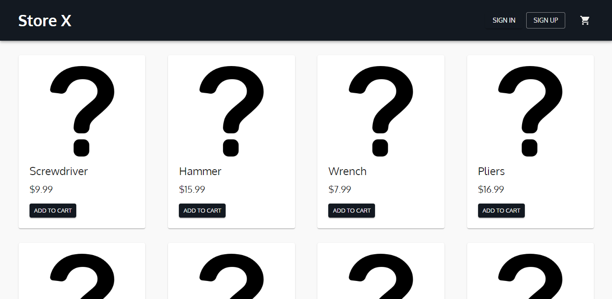

# Store X

Uma página de uma loja virtual com seções de produtos e um carrinho de compras, que permite aos usuários adicionar produtos ao carrinho, ajustar as quantidades, e visualizar o valor individual e o total da compra.

O projeto é de minha autoria e foi inspirado em outras aplicações existentes, adaptando seus designs e recursos. A aplicação foi construída utilizando as tecnologias TypeScript, React, Material-UI (MUI) e Styled Components. Confira o resultado: 💻<https://storex-tau.vercel.app/>.



</br>

## 🎯 Objetivos

Os usuários podem:
> - Avaliar o layout ideal da interface, considerando as dimensões da tela do dispositivo
> - Visualizar os estados de "hover" e "focus" para todos os elementos interativos presentes na página
> - Adicionar, remover e alterar a quantidade de produtos ao carrinho
> - Visualizar o valor unitário e o total

O objetivo deste projeto foi colocar em prática o Redux Toolkit, um padrão de gerenciamento de estado mais atual utilizado em conjunto com o Redux.

</br>

## 🔧 Propriedades e Tecnologias

> - Vite
> - TypeScript
> - React 
> - Redux Toolkit
> - Material-UI (MUI)
> - Styled Components

</br>

## 🧠 Meu aprendizado

> - Redux Toolkit

O Redux Toolkit simplifica consideravelmente o processo de configuração e utilização do Redux, eliminando a necessidade de escrever extenso código padrão. Em vez disso, os desenvolvedores podem criar apenas um "slice", utilizando o "createSlice()", em vez de um reducer convencional, e a função do slice cuida automaticamente de disponibilizar as ações necessárias.

```ts
export const cartSlice = createSlice({
	name: "cart",
	initialState,
	reducers: {
		addProduct: (state: CartStateType, action: CartActionType) => {
			const existingProduct = state.products.find(product => product.id === action.payload.id);

			if (existingProduct) {
				if (existingProduct.quantity) {
					existingProduct.quantity += 1;
				}
			} else {
				state.products.push({ ...action.payload, quantity: 1 });
			}
		}
    }
});

export const { addProduct } = cartSlice.actions;
```

Outro aspecto que contribui para essa simplificação é que o Redux Toolkit (RTK) não requer preocupação com alterações diretas no estado. Com a ajuda da biblioteca Immer, esse problema pode ser facilmente contornado.

```ts
import { configureStore } from "@reduxjs/toolkit";
import cartReducer from "./cart/cartSlice";
import drawerShoppingCartReducer from "./drawer-shopping-cart/drawerShoppingCartSlice";

const store = configureStore({
    reducer: {
        cart: cartReducer,
        drawer: drawerShoppingCartReducer,
    }
});

export type RootState = ReturnType<typeof store.getState>
export default store;
```

Também encontramos facilidades no gerenciamento, uma delas é a atualização da "store" através do método "configureStore()". Com ele, podemos criar a loja (store) sem a necessidade de manualmente combinar os reducers, entre outras vantagens.

[saiba mais!](https://redux-toolkit.js.org/introduction/getting-started)

</br>

## 💻 Rodando o projeto

Para conferir a versão final é só acessar o link: 💻<https://storex-tau.vercel.app/>.


</br>

## Autor

- LinkedIn - [Pedro A. Lima](https://www.linkedin.com/in/pedroalima6/)